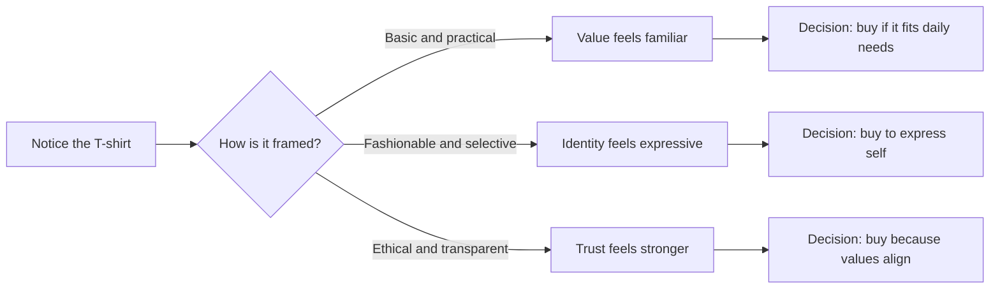

# Persuasion, Trust, and the Design of Attention

If you have ever chosen one product over another, clicked on one message instead of another, or nodded along with an idea because it felt convincing, you have already met persuasion in practice. It is not a trick. It is a basic part of communication. People are constantly trying to shape what others notice, how they interpret it, whether they trust it, and what they do next.

Designers are especially close to this work because design is rarely only about appearance. A design often does the job of directing attention, clarifying meaning, and making an option feel credible or valuable. Persuasion does not begin with a deceitful slogan; it begins with an understanding of how people think, decide, and react.

This chapter will focus on persuasion as a useful tool, not a magical force. It is a way of making an idea easier to understand, more believable, and more likely to matter.

## What Is Persuasion?

Persuasion is the process of influencing how someone sees a situation, what they value, and what action they are willing to take. It shapes attention, interpretation, trust, and action.

A person may:

- notice an object because of its placement or context
- interpret it differently depending on how it is framed
- trust it more because it appears familiar or expert-backed
- act because a message makes the next step feel logical, timely, or worthwhile

Persuasion is not the same as coercion or manipulation.

- Coercion uses force, pressure, or threat. It removes real choice.
- Manipulation uses hidden intent, deception, or emotional pressure to steer someone away from their own judgment.
- Persuasion aims to help someone understand, consider, and choose. It can be ethical when it is honest, transparent, and respectful of a person’s ability to decide.

A useful way to remember the difference is this: persuasion helps people move toward a conclusion; coercion makes them move despite their own will; manipulation tricks them into moving without full awareness.

## A Plain White T-Shirt: One Product, Many Frames

A plain white T-shirt is a simple object. Its physical features are mostly the same no matter how it is presented:

- cotton or another fabric
- a basic shape
- a neutral color
- a standard size and fit

Yet the same T-shirt can be framed very differently depending on the story around it.

### Version 1: Utility

This shirt is basic, durable, and easy to style. It works for daily wear. It is affordable and practical.

This frame emphasizes function: comfort, price, everyday usefulness.

### Version 2: Minimalism

This shirt is a clean canvas. It allows the wearer to express restraint, calm, and modern simplicity.

This frame emphasizes identity and aesthetic intention.

### Version 3: Status or exclusivity

This shirt is limited release, made in small quantities, and worn by a select group.

This frame emphasizes scarcity and social meaning.

### Version 4: Ethical positioning

This shirt is made with organic fiber, fair labor, and a transparent supply chain.

This frame emphasizes values and trust.

The product did not change. The context did. The same shirt can be sold as a practical staple, a fashion statement, a badge of status, or a moral choice. This is the heart of persuasion: not changing the object, but changing the meaning attached to it.

## Why Persuasion Works

People do not make decisions in a purely rational vacuum. They rely on shortcuts, habits, emotions, social cues, and context. Persuasion works when it speaks to how real people actually decide.

This is why design and marketing are so closely tied to psychology. A message is not only information; it is a cue that helps someone interpret a situation. It can shape attention by what stands out, create trust by how the message is delivered, and guide action by making a next step feel obvious.

## Robert Cialdini’s Principles of Influence

Robert Cialdini’s psychology of persuasion is widely taught because it describes patterns that show up often in real decision-making. The principles are not magic, and they are not inherently unethical. They become ethical or unethical depending on the intent, honesty, and respect behind their use.

### 1. Reciprocity

People feel an obligation to return favors or kindness.

Example: A free sample or helpful consultation makes people more likely to buy, because they feel they should “give back” in some way.

Ethical use: offering useful information, samples, or value without hidden pressure.

Misuse risk: creating obligation through pressure or guilt.

### 2. Commitment and Consistency

People like their choices to align with what they have already said or done. Once a person commits to an idea, they are more likely to stay consistent with it.

Example: A person who says they value quality is more likely to buy a higher-priced item that fits that identity.

Ethical use: encouraging thoughtful choices that match a person’s values.

Misuse risk: exploiting someone’s earlier statement to push a purchase they have not fully reconsidered.

### 3. Social Proof

People look to others, especially similar others, to decide what seems normal, safe, or desirable.

Example: Reviews, customer numbers, or a busy café can signal that something is trusted.

Ethical use: sharing honest testimonials or clear evidence of widespread approval.

Misuse risk: faking popularity, using misleading reviews, or creating false urgency.

### 4. Liking

People are more likely to be persuaded by people they like, admire, or feel similar to.

Example: A brand that feels friendly, relatable, or visually aligned with a customer often gains more trust.

Ethical use: building real connection and clarity.

Misuse risk: using flattery or fake familiarity to manipulate trust.

### 5. Authority

People are more likely to trust experts, credentials, and recognizable expertise.

Example: A product with expert endorsements or clear design standards may feel more reliable.

Ethical use: showing relevant expertise and honest competence.

Misuse risk: presenting weak claims as authoritative or using status symbols to overshadow substance.

### 6. Scarcity

People value things more when they seem limited, rare, or time-sensitive.

Example: “Only a few left” can motivate action, especially when the scarcity is real.

Ethical use: genuine product limits, seasonal urgency, or honest availability.

Misuse risk: manufacturing fear or false time pressure.

### 7. Unity

Cialdini later emphasized a sense of shared identity or belonging. People respond more strongly to messages that feel aligned with a group they identify with.

Example: A brand that signals “this is for people like us” can feel more trustworthy and motivating.

Ethical use: building real community, shared purpose, and inclusion.

Misuse risk: using group identity to pressure or exclude others.

## Other Useful Ideas Beyond Cialdini

Cialdini offers a strong foundation, but persuasion is broader than a list of six or seven triggers. Several other ideas from psychology and communication help explain how people decide.

### Framing and Loss Aversion

People do not just weigh facts; they interpret them through framing. The same fact can feel different depending on how it is presented.

Example: “This shirt is 20% off” may feel attractive, but “This shirt will cost 20% more tomorrow” can feel more urgent. The same price change is framed differently, and the emotional response changes.

Behavioral economics teaches that people react strongly to loss. A loss feels more significant than an equivalent gain. This is why limited-time offers, warnings, and “don’t miss out” language can be powerful.

Ethical use: clear, honest urgency that respects the customer’s decision.

Misuse risk: fear-based messaging that ignores the actual value of the decision.

### The Need for Cognitive Ease

People prefer information that feels clear, familiar, and easy to process. When a message is cognitively easy, people are more likely to trust it.

Example: A clean design with obvious hierarchy is easier to understand than a crowded one. Clarity supports persuasion because confusion reduces trust.

Ethical use: simplifying information so people can make informed decisions.

Misuse risk: oversimplifying complex facts or hiding important trade-offs behind visual clarity.

### Narrative and Meaning

People do not just process facts; they interpret them through stories. A product becomes meaningful when it connects to a larger story: identity, value, purpose, or belonging.

Example: A plain white T-shirt can be framed as “the everyday uniform of a creative workplace,” “the sign of practical minimalism,” or “the symbol of a small-batch, ethically produced brand.” The shirt is the same, but the story changes its meaning.

Ethical use: telling a truthful story rooted in realities of production, value, and community.

Misuse risk: inventing a story that does not match the product or the people behind it.

## Comparison Table

| Principle or idea | How it works | Ethical use | Misuse risk |
| --- | --- | --- | --- |
| Reciprocity | People feel obliged to return a gift, favor, or helpful experience | Offer value openly and without pressure | Create guilt, obligation, or emotional debt |
| Commitment and Consistency | People prefer choices that match their prior views or actions | Help people act in line with their values | Trap people into decisions they have not re-evaluated |
| Social Proof | People copy what others seem to choose | Share real evidence and honest community feedback | Fake popularity or manipulate peer pressure |
| Liking | People trust those they feel close to or aligned with | Build genuine rapport and clear brand personality | Use flattery, fake intimacy, or emotional manipulation |
| Authority | People trust credentials and expertise | Show real competence and relevant experience | Pretend expertise or hide uncertainty for status |
| Scarcity | Limited access increases perceived value | Communicate genuine limits and honest urgency | Manufacture fear or false urgency |
| Framing | Meaning changes based on how a choice is presented | Present accurate context and trade-offs | Distort facts to make a bad option feel better |
| Loss Aversion | People feel losses more strongly than gains | Explain risks and benefits transparently | Exploit fear to bypass thoughtful choice |
| Narrative | Meaning is shaped by story and identity | Tell truthful, coherent stories | Invent narratives that conceal the real product or value |

## A Decision Journey: How Persuasion Shapes Choice

This diagram is simple on purpose. It shows that similar people can arrive at different decisions because the same object is interpreted through different frames. Persuasion is not only about getting someone to buy; it is about helping them decide in a meaningful way.

## Ethical Cautions

Persuasion can be a responsible design tool, but it should never be confused with a moral free pass. A designer should ask whether a persuasive move is honest, relevant, and respectful of the person’s agency.

Some warning signs:

- The message hides important information.
- The design creates fear without allowing thoughtful reflection.
- A person is pushed to act before they can assess the decision.
- The product is being framed to match a fantasy rather than reality.
- The persuasive strategy depends on vulnerability, confusion, or social pressure.

A well-designed persuasive message should be easy to understand, honest about trade-offs, and fair to the person receiving it. If the design depends on confusion, guilt, or coercive urgency, it is likely not a good practice.

## Questions to Ask Before Trying to Persuade

Before trying to influence someone, a designer should ask:

- What am I really trying to change: attention, interpretation, trust, or action?
- Is my message truthful, or am I relying on hype and ambiguity?
- Am I helping the person decide, or am I pressuring them?
- What assumptions am I making about the audience?
- Is this offer aligned with their actual needs or with my own desire to sell?
- Am I using urgency in a genuine way, or creating artificial panic?
- What information am I hiding, minimizing, or simplifying?
- Would I feel comfortable if the person saw the decision process clearly?
- Is the design making the true value easier to understand, or is it distracting from it?
- What would happen if the person slowed down and thought carefully for a full minute?

These are not just ethical questions. They are practical design questions. Persuasion works best when it is grounded in clarity and respect, not manipulation.

## The White T-Shirt as a Design Problem

A plain white T-shirt is a good example of how design frames value. The designer can choose whether the shirt is presented as:

- a reliable everyday essential
- a minimalist statement
- a luxury object with scarcity
- a symbol of ethical production and transparent values

The same garment can support different messages without changing the product itself. That is why branding matters. A brand does not create the shirt from nothing; it interprets it, organizes context, and encourages a certain way of seeing.

This is also why persuasion is never purely a sales problem. It is a communication problem. It asks: what story is this object telling, and what kind of person is invited to believe it?

## Explore Further

If you want to deepen this topic, good search terms include:

- Robert Cialdini principles of persuasion summary
- persuasion vs manipulation examples
- behavioral economics framing examples
- loss aversion in marketing
- cognitive ease and design psychology
- narrative persuasion in branding
- ethical persuasion design questions

This section is intentionally not a list of sources or links. The goal is to point toward research directions, not to invent references.

## What You Should Remember

- Persuasion is the art of shaping attention, interpretation, trust, and action in honest, meaningful ways.
- It is different from coercion and manipulation because it respects the person’s ability to choose.
- Cialdini’s principles—reciprocity, commitment and consistency, social proof, liking, authority, scarcity, and unity—help explain common patterns of influence.
- Framing, loss aversion, cognitive ease, and narrative meaning show that decisions are shaped by context as much as facts.
- The same plain white T-shirt can support many persuasive stories without changing the shirt itself.
- Ethical persuasion depends on clarity, honesty, and respect for the other person’s judgment.

Persuasion is not about forcing a person to agree. It is about making a shared understanding more possible, more credible, and more actionable.
