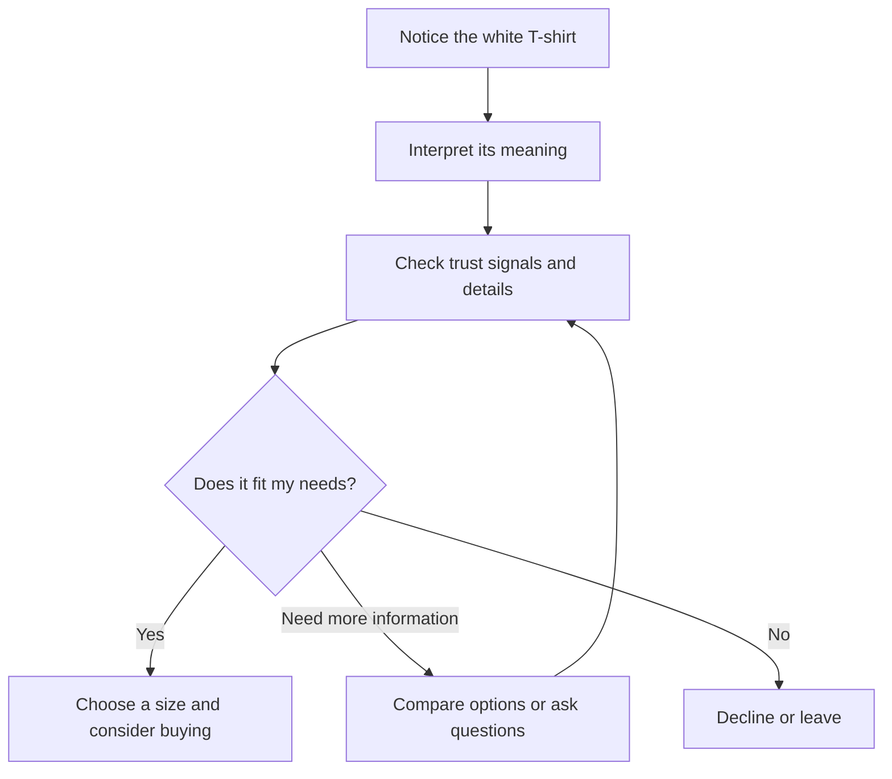

# Persuasion, Branding, and Design

Design is often described as the arrangement of form, color, and function. But design also shapes what people notice, what they think something means, and whether they trust it enough to act. That is where persuasion enters the picture.

Persuasion is not magic, and it is not a trick. It is the process of helping people notice a value, interpret a meaning, feel some confidence, and then decide. In design, persuasion is often quiet: it can show up in the way a product is labeled, the way a page is organized, the way an image makes a message feel credible or urgent. A persuasive design does not force a person to choose one thing. It helps the person understand why a choice might matter.

A plain white T-shirt is a useful example. The shirt itself is a basic object: fabric, cut, color, and function. But the same T-shirt can be presented as “an everyday essential,” “a premium wardrobe staple,” “a limited-release artist collaboration,” or “the shirt you wear to make a statement.” The garment does not change. The framing changes. That framing influences attention, interpretation, trust, and action.

In other words, persuasion is a tool for shaping the conditions of choice.

## Persuasion, Coercion, and Manipulation

It is important to distinguish persuasion from coercion and manipulation.

- Persuasion invites, frames, and supports a decision.
- Coercion uses pressure, threat, or force to remove real choice.
- Manipulation uses hidden influence, deception, or exploiting someone’s vulnerabilities without regard for their informed consent.

A persuasive designer is trying to communicate value honestly. A manipulative designer tries to bypass thinking. A coercive designer tries to eliminate choice entirely.

A simple comparison helps:

| Approach | What it does | Typical method | Ethical status |
| --- | --- | --- | --- |
| Persuasion | Helps people weigh reasons and act with understanding | Clear framing, relevant evidence, honest value | Usually ethical when transparent |
| Coercion | Removes or overrides free choice | Threats, pressure, intimidation | Unethical |
| Manipulation | Exploits confusion, emotion, or weakness | Hidden motives, misleading cues, pressure without transparency | Unethical |

Good persuasion does not say, “You must do this.” It says, “Here is why this might matter to you.” That difference matters.

## Why Persuasion Matters in Design

People are constantly filtering information. We do not process every message with equal attention. We notice what stands out, what feels familiar, what seems trustworthy, and what appears urgent. Design influences all of those things.

Persuasion in design operates across four layers:

1. Attention: What gets noticed first?
2. Interpretation: What does it mean?
3. Trust: Why should I believe this?
4. Action: What do I do next?

Psychologist Robert Cialdini's framework identifies several recurring patterns in human decision-making. The principles below are not magic buttons; they are useful descriptions of tendencies people often show when they are deciding, comparing, or judging value.

## A White T-Shirt, Reframed

Take a plain white T-shirt. It is a single product with a simple material and a standard function. But branding and design can reshape how the consumer understands it.

Consider these framings:

- A plain white T-shirt as a “blank canvas” suggests creativity, self-expression, and customization.
- A white T-shirt marketed as “everyday comfort” emphasizes practicality, ease, and reliability.
- A white T-shirt sold as a “premium essential” suggests quality, durability, and taste.
- A white T-shirt described as “limited edition” creates urgency and scarcity.

The shirt is the same physical object in every case. What changes is the story around it.

This is not deception, as long as the product is what it is claimed to be. The design is shaping meaning. It is helping the buyer interpret the shirt in a way that fits a lifestyle, identity, or need.

When persuasion is honest, it is not about pretending the shirt is something it is not. It is about helping a person see a value they might otherwise overlook.

## Robert Cialdini’s Principles of Influence

Robert Cialdini is a social psychologist whose work on influence is widely used in marketing, design, and communication. His major principles describe patterns in human decision-making. They are useful because they show how people often respond to cues, context, and social signals. They are not automatic rules.

Here are the core ideas:

### 1. Reciprocity

People tend to feel obliged to return favors or gestures. If someone gives us something, we often feel a need to give something back.

Example: A brand gives a free sample, a helpful style guide, or a small bonus. The recipient may feel more inclined to buy, respond, or return the favor.

Ethical use: give useful value without pressure. Misuse risk: creating a sense of debt that pushes people to buy before they are ready.

### 2. Commitment and Consistency

People like their choices to be consistent with their previous actions, beliefs, or identity. Once someone has made a small commitment, they may be more likely to follow through on a larger one.

Example: A person who buys a durable, minimalist basic may later feel more consistent if they begin buying more carefully chosen essentials.

Ethical use: support a person’s values with relevant next steps. Misuse risk: using small “yeses” to escalate into decisions the person does not really want.

### 3. Social Proof

People often look to others to decide what is appropriate or desirable. If many people are doing something, it can feel safer or smarter to join in.

Example: A product page showing “best seller” or a school club using a white T-shirt as part of a shared identity can signal that others have accepted the choice.

Ethical use: provide honest evidence and real user experiences. Misuse risk: faking popularity or exploiting fear of missing out.

### 4. Liking

People are more likely to trust and respond to people, brands, or messages they feel a connection to. Familiarity, similarity, and warmth increase influence.

Example: A designer may seem more credible when the brand language feels human, relatable, and consistent with the audience’s values.

Ethical use: build trust through clarity and authenticity. Misuse risk: exploiting emotional connection rather than the actual value of the offer.

### 5. Authority

People are more likely to trust signals of expertise, credentials, or confidence. We often defer to perceived experts.

Example: A clothing brand becomes more persuasive when it clearly explains the material, fit, and production process. A shirt description that is honest and specific can be more convincing than a slogan alone.

Ethical use: show expertise honestly and relevantly. Misuse risk: pretending to be an authority without substance.

### 6. Scarcity

People tend to value things more when they seem limited, rare, or time-sensitive. Scarcity can create urgency.

Example: A “limited run” T-shirt may feel more desirable because there are fewer of them, but the quality of the product still matters.

Ethical use: use real scarcity and honest timing. Misuse risk: inventing false urgency or making people feel they must act before thinking.

## A Quick Comparison Table

| Principle | Main mechanism | Ethical use | Misuse risk |
| --- | --- | --- | --- |
| Reciprocity | People feel obliged to return a favor | Offer genuine value and helpfulness | Pressure people into feeling indebted |
| Commitment and Consistency | People want choices to match previous commitments | Reinforce values, not just purchases | Push people into escalating decisions |
| Social Proof | People copy what others seem to prefer | Show honest community evidence | Fake popularity or herd behavior |
| Liking | People trust familiar, pleasant, relatable signals | Be authentic and relatable | Manipulate emotional attachment |
| Authority | People defer to perceived expertise | Demonstrate competence clearly | Pretend expertise without evidence |
| Scarcity | Limited supply heightens value | Use real scarcity and transparency | Manufacture false urgency |

These ideas are not inherently bad. They become ethical or unethical based on intention, transparency, and respect for human agency.

## Beyond Cialdini: Other Useful Concepts

Cialdini gives a strong foundation, but persuasion is broader than a list of tactics. Designers also benefit from ideas from behavioral economics, rhetoric, and communication.

### Framing and Loss Aversion

People do not just evaluate what they gain; they also weigh what they might lose. This is one reason a “limited-time offer” can feel urgent: the person imagines missing out on something valuable.

For the white T-shirt, framing can change the decision in subtle ways:

- “Get a premium everyday essential” emphasizes gain.
- “This shirt is almost gone” emphasizes loss.
- “Choose the fit that fits your life” frames relevance.
- “Don’t miss your chance to own a limited release” adds urgency.

The physical product stays the same, but the person’s interpretation changes. That is framing.

A designer who understands framing can communicate more clearly. But the ethical designer also remembers that the person is still a decision-maker, not an object to be manipulated.

### Cognitive Dissonance

People experience discomfort when their beliefs, values, and actions do not line up. Designers can sometimes use this discomfort productively by helping people recognize inconsistency in a respectful way.

Example: A person says they care about quality and craftsmanship, then sees a T-shirt with clear fabric details, a durable cut, and a transparent origin story. The product becomes more persuasive because it aligns with an identity the buyer already values.

The ethical question is whether the design helps the person act consistently with their values or simply exploits their desire to feel coherent.

### Ethos, Pathos, and Logos

Ancient rhetorical thinking still matters. Persuasion often works through three appeals:

- Ethos: credibility and trustworthiness
- Pathos: emotion and identification
- Logos: reason and evidence

A good design typically uses all three in some form. A shirt may be persuasive because it looks well made (ethos), feels aligned with a lifestyle or identity (pathos), and explains material quality or fit in clear terms (logos).

This is a helpful reminder: persuasion is not only emotional, and it is not only logical. People make decisions at the intersection of trust, feeling, and reason.

## Ethical Cautions

Persuasion is a powerful tool, and design professionals should treat it with care.

A few cautions are worth keeping in mind:

- Do not hide important information. If the offer is genuine, say so clearly.
- Do not exploit fear or confusion. Urgency is useful only when it is honest.
- Do not confuse attention with understanding. A flashy design can get attention without creating informed decisions.
- Do not use vulnerability as a lever. People in stress, uncertainty, or urgency deserve respect, not manipulation.
- Do not confuse preference with value. A product may be desired for a story, but it still has to be useful and honest.

The goal is not to force a person into the action you want. The goal is to help them understand the option clearly enough to decide for themselves.

## Questions to Ask Before Trying to Persuade

Before a designer tries to influence someone, a few questions can help clarify purpose and ethics:

- What am I actually trying to help the person understand?
- Is the message honest, or am I trying to hide weaknesses behind emotion?
- What assumptions am I making about the audience?
- Am I giving relevant information, or just creating urgency?
- Could this be seen as exploiting fear, shame, or insecurity?
- Am I helping someone make an informed choice, or am I steering them past reflection?
- Does the product or message deserve the attention I am trying to create?

If the answer to those questions is unclear, the design probably needs more work.

## A Simple Decision Journey

This diagram is a simplified decision journey. A useful design supports every branch, including the exit. Good persuasion does not close the door; it makes the decision clearer.

## Explore Further

If you want to explore this topic in more depth, try searching for these phrases:

- Robert Cialdini principles of influence
- persuasion vs manipulation in design
- framing effect behavioral economics
- loss aversion examples in marketing
- ethos pathos logos examples
- persuasive design ethics user experience

The goal is not to memorize tactics. It is to understand how people interpret meaning and make choices, then to use that understanding responsibly.

## What You Should Remember

- Persuasion helps shape attention, interpretation, trust, and action.
- Persuasion is different from coercion and manipulation because it respects the person’s ability to choose.
- Cialdini’s principles describe common patterns of influence, not guaranteed outcomes.
- Framing, loss aversion, and rhetorical appeals add more tools for understanding how people decide.
- The same white T-shirt can be framed in many ways without changing the garment itself; the story around it changes its meaning.
- Ethical design is not the absence of persuasion. It is persuasion with honesty, context, and respect.

Design is persuasive whenever it helps people see value clearly. The best design does not trick people into buying; it helps them understand what matters, what is trustworthy, and why a decision may be worth making.
