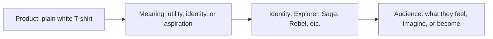

# Brand Archetypes and the Meaning of Choice

A product does not only do a job. It also says something. A plain white T-shirt, for example, is not just fabric and stitching. It can signal a mood, a belief, a status, a lifestyle, or a value system. This is where brand archetypes become useful.

Brand archetypes are a way of organizing familiar patterns of meaning. They help us understand how brands create recognition and emotional resonance. Instead of asking only, “What is this product?” we can ask, “What does it mean, and what kind of person does it invite someone to become?”

This matters because people often buy stories as much as products. They are not simply purchasing an object; they are choosing a feeling, an identity, a worldview, or a possible self.

## What Is an Archetype?

An archetype is a generalized pattern that appears across stories, culture, and human experience. It is not a literal personality test and it is not a rigid box. A person is not just one archetype, and a brand is not a single static character either.

Archetypes are useful because they help describe recurring narratives: the rebel who resists the norm, the caregiver who protects, the explorer who seeks new ground, the ruler who creates order, the sage who seeks truth.

In branding, archetypes are a practical framework. They give a product or organization recognizable meaning without pretending that identity is simple or fixed.

A person may contain multiple tendencies at once. One day they may act like a Hero, another day like a Jester, and still elsewhere like a Caregiver or an Everyperson. The same is true for brands. A company may feel playful in one campaign and serious in another. That is not inconsistency; it is complexity.

Cultural context matters too. The same archetype can be read differently across communities, histories, and social norms. A symbol of rebellion in one place may be seen as ordinary or even conservative in another. A brand archetype is not universal fact; it is a pattern that gains meaning in context.

## The Practical Question

When choosing a brand archetype, the most useful question is not only, “What kind of brand are we?” It is this:

“What does the audience get to feel, imagine, or become by choosing this brand?”

This is the core of brand meaning. A customer is not just buying a shirt. They are buying access to an identity or aspiration.

A plain white T-shirt can represent:

- freedom and movement
- discipline and simplicity
- luxury and exclusivity
- creativity and individuality
- care, ethics, and community

The shirt stays the same. The meaning changes.

## The Plain White T-Shirt: One Product, Many Archetypes

A basic white T-shirt is neutral in color and simple in construction. That neutrality makes it a powerful canvas. It can carry almost any story without changing shape or fabric.

Here are three dramatically different ways to position the same shirt.

### 1. The Explorer T-Shirt

This shirt is made for movement, travel, and discovery. It is durable, unfussy, and comfortable enough to live in while the wearer explores the city, the coast, the mountains, or an unfamiliar routine.

What does the audience get to feel, imagine, or become?

- independent
- curious
- free from rigid expectations
- ready for the next adventure

This archetype appeals to people who want a brand to feel open-ended and alive. The shirt becomes a companion to change, not a monument to stillness.

### 2. The Sage T-Shirt

This shirt is quiet, intentional, and well considered. It favors clarity over noise. It is a foundational garment for someone who values simplicity, discipline, and thoughtful living.

What does the audience get to feel, imagine, or become?

- grounded
- discerning
- calm and competent
- clear in judgment

This archetype works when a brand wants to suggest wisdom rather than hype. The T-shirt becomes a signal of self-knowledge and restraint.

### 3. The Rebel T-Shirt

This shirt is less about conformity and more about disruption. It is worn by someone who rejects the polished, overmanaged image of modern consumption and prefers something direct, rough-edged, or nonconformist.

What does the audience get to feel, imagine, or become?

- unbothered
- bold
- resistant to social pressure
- original and unfiltered

This archetype turns an ordinary object into a statement of independence. The shirt is not just basic; it is anti-performance.

These three versions are all the same shirt. The archetype changes the story, and the story changes how people read the product.

## Common Brand Archetypes

The following archetypes are widely used because they are recognizable, culturally rich, and easy to translate into messaging, visual style, and product positioning.

### Explorer
The Explorer seeks new experiences, freedom, and discovery. They dislike feeling trapped by the familiar. Brands in this archetype often feel adventurous, unstructured, and open to possibility.

### Sage
The Sage values truth, knowledge, and thoughtful understanding. They aim to make complexity legible and help others see clearly. Brands in this archetype often feel calm, honest, and intellectually grounded.

### Creator
The Creator values originality, expression, and making things that matter. They are drawn to craft, process, and making visible identity through work.

### Ruler
The Ruler values order, standards, authority, and confidence. They like structure, excellence, and a sense that things are under control.

### Caregiver
The Caregiver values protection, nurturing, and support. They create trust through warmth, reliability, and genuine concern for others.

### Rebel
The Rebel resists convention and challenges the status quo. They value authenticity and disruption over comfort and approval.

### Hero
The Hero is driven by achievement, courage, and overcoming challenge. Brands in this archetype often feel motivating, ambitious, and high-performing.

### Everyperson
The Everyperson values accessibility, honesty, and shared experience. They represent real life, ordinary use, and practical belonging.

### Innocent
The Innocent values purity, optimism, and simplicity. They tend to feel wholesome, hopeful, and sincere.

### Jester
The Jester values play, wit, and looseness. Brands in this archetype often feel humorous, spontaneous, and socially lively.

### Lover
The Lover values intimacy, beauty, and emotional connection. Their branding often feels sensual, rich, and deeply personal.

### Magician
The Magician values transformation, possibility, and imagination. They promise that things can become something more than they were before.

## Comparison Table

| Archetype | Core emotional promise | Typical visual and verbal signals | Audience feeling or identity |
| --- | --- | --- | --- |
| Explorer | Freedom, discovery, possibility | Open space, travel imagery, unstructured energy | “I am curious and independent.” |
| Sage | Clarity, wisdom, truth | Clean design, careful language, minimal noise | “I think carefully and know what matters.” |
| Creator | Originality, craft, expression | Tools, process, experimentation, handmade feel | “I make and shape my own world.” |
| Ruler | Order, standards, confidence | Strong geometry, authority, polished structure | “I lead and maintain quality.” |
| Caregiver | Safety, trust, support | Warm colors, reassuring tone, community focus | “I protect and nurture.” |
| Rebel | Disruption, authenticity, resistance | Bold contrast, rough edges, nonconformist cues | “I do not follow the crowd.” |
| Hero | Courage, achievement, progress | Strong movement, challenge, overcoming obstacles | “I rise to what matters.” |
| Everyperson | Accessibility, belonging, practicality | Friendly tone, familiar scenes, honest simplicity | “I am part of the real world.” |
| Innocent | Purity, hope, simplicity | Light tones, straightforward symbols, optimism | “I choose what is wholesome and true.” |
| Jester | Play, humor, delight | Wit, contrast, surprise, energy | “I enjoy life and do not take myself too seriously.” |
| Lover | Beauty, intimacy, connection | Rich textures, emotional imagery, sensuality | “I value closeness and meaning.” |
| Magician | Transformation, wonder, possibility | Mystique, motion, striking before-and-after stories | “I can become more than I was.” |

## A Simple Meaning Flow

This diagram shows the logic behind archetypes. The product itself is not the entire story. Meaning attaches to it, then identity emerges, and finally the audience is invited into a role or emotional position.

## Archetypes Are Not Destiny

A brand archetype is a useful tool, not a prison. It is a model for meaning, not a diagnosis of personality. A brand may contain several tendencies at once. A company that is partly Explorer and partly Sage may still be coherent if the combination is well understood.

The same is true for people. A person may be creative and practical, rebellious and caring, ambitious and playful. Labels can help explain patterns, but they should never flatten a real person or an organization into a single identity.

Using archetypes well means understanding complexity. A good brand does not force all meaning into one narrow lane. It chooses the most fitting dominant story while leaving room for nuance.

This matters especially in design. Visual language, tone, and messaging should work together, but they should not become a rigid costume. A brand should feel recognizable without becoming artificial.

## Questions to Ask When Choosing an Archetype

Before choosing an archetype, a designer or brand strategist should ask:

- What does this product already suggest on its own?
- What feeling is the audience seeking from the experience?
- What kind of person does the brand want to invite in?
- Does the archetype help the product make sense, or does it create confusion?
- Are we choosing meaning that is genuine, or are we trying to imitate something fashionable?
- Can the audience recognize the brand quickly, without explanation?
- Does the archetype align with what the product actually does and the values behind it?
- Will the story still work across different contexts and cultures?
- Are we emphasizing one emotional promise while ignoring the rest of the brand?
- What happens if the audience sees the brand in a different cultural setting?

A strong archetype is not the loudest one. It is the one that makes the product legible, emotionally resonant, and believable.

## Archetypes in Practice

Different brands can use the same basic product and create drastically different meanings through archetype selection.

### The Explorer Shirt

An outdoor or travel-oriented brand may frame the shirt as durable, mobile, and ready for movement. The promise is independence, curiosity, and an open path ahead.

### The Sage Shirt

A minimal, intentional lifestyle brand may frame the shirt as clean, thoughtful, and quietly confident. The promise is clarity, discipline, and a life shaped by meaningful choices.

### The Rebel Shirt

A youth-oriented or independent label may frame the shirt as anti-status and anti-conformity. The promise is individuality, challenge, and refusal to be absorbed by the norm.

The identical shirt becomes a vehicle for multiple meanings because each archetype emphasizes a different emotional promise.

## Design and Meaning

Brand archetypes are not just for marketing copy. They shape design choices.

A brand in the Sage archetype may prefer:

- restrained typography
- quiet palettes
- spacious layouts
- honest, plain language

A brand in the Rebel archetype may prefer:

- high contrast
- rough texture
- asymmetry
- bold, challenging statements

A brand in the Magician archetype may prefer:

- transformation scenes
- striking visual contrast
- atmosphere and anticipation
- a sense that change is possible

Design turns abstraction into an experience. The archetype gives direction, but the visual system gives it form.

## What You Should Remember

- Brand archetypes are a practical way to give products and organizations recognizable meaning.
- They are generalized cultural patterns, not rigid personality types.
- A person or brand can contain multiple tendencies, and cultural context changes how an archetype is read.
- The key question is not only what the brand is, but what the audience gets to feel, imagine, or become.
- A plain white T-shirt can carry radically different meanings depending on whether it is framed through Explorer, Sage, Rebel, or another archetype.
- Archetypes are useful when they clarify identity, not when they flatten it.
- Strong branding is a thoughtful match between product, meaning, audience, and cultural context.

A good brand does not simply sell an object. It offers a story someone can step into, with enough clarity and honesty that the choice feels meaningful.
