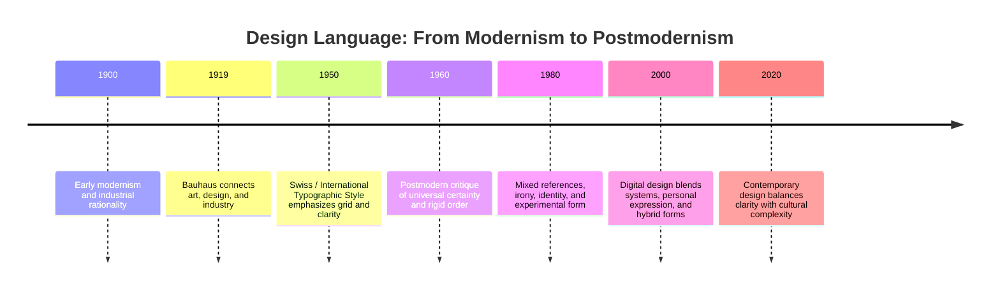

# Design Language and the Meaning of Visual Form

Visual design is not simply decoration. It is a way of organizing attention, clarifying ideas, and signaling values. A page, a screen, a product package, or a storefront all communicate before a person reads a single word. The choice of type, spacing, grid, color, texture, and composition tells the viewer how to feel, what to notice first, and what kind of thinking the object expects.

For a first-year student, it can be helpful to think of design as a language. It has structure, rhythm, vocabulary, and tone. Some designers aim for calm clarity. Others aim for disruption, humor, or emotional intensity. The same basic object can be framed very differently depending on the design language around it.

## From Early Modernism to the Bauhaus

Modernism in design grew out of a broader effort to make the world more rational, legible, and efficient. In the late nineteenth and early twentieth centuries, industrial production, urban growth, and new technologies pushed designers to think differently about form. They wanted systems that could work clearly across many settings.

This led to a strong interest in simplicity, function, and standardization. Objects were expected to do their jobs well without unnecessary decoration. In architecture and design, this meant clean lines, honest materials, and purposeful structure.

The Bauhaus was a major influence in this movement. It argued that art, design, and industry should be connected rather than separated. Students learned to think across disciplines: painting, architecture, furniture, typography, and industrial design all belonged to the same problem of shaping material culture clearly and intelligently.

The Bauhaus did not simply reject ornament. It questioned whether ornament was meaningful or whether a form should arise from purpose and function. The result was often a stripped-down visual language: geometric form, disciplined spacing, strong hierarchy, and an emphasis on clarity.

This approach was influential because it offered a usable framework for modern life. It promised that design could be rational as well as beautiful.

## The Swiss / International Typographic Style

The Swiss or International Typographic Style developed in the mid-twentieth century and became one of the clearest expressions of modernist design thinking. It emphasized:

- grid-based organization
- asymmetrical layout
- clear hierarchy
- sans-serif type
- objective, rational spacing
- strong contrast between text and background

This style treated typography as a system rather than a decorative flourish. The designer’s job was to make information readable, structured, and efficient. The grid gave order. The hierarchy gave emphasis. The reduction of ornament was meant to improve comprehension.

In this way, the Swiss style was less about personal expression and more about making communication legible at a glance. It was powerful in information design, posters, corporate identity, and editorial systems.

## Modernism’s Core Ideas

Modernism often valued the following principles:

- clarity over confusion
- function over decoration
- universality over local detail
- hierarchy over equal visual weight
- order over chaos
- rational systems over expressive improvisation

These ideas were influential because they made design feel disciplined and dependable. Good design, in this view, should not distract from the message. It should support understanding.

## Postmodernism as a Reaction

Postmodernism emerged partly as a reaction against modernist certainty. It questioned the idea that one style, one system, or one truth could organize all visual culture in a universal way. It pushed back against the assumption that restraint, order, and objective neutrality were always the most honest or effective forms of design.

Postmodern design often used:

- irony
- quotation or reference
- collage
- expressive typography
- playful disruption of grids
- contradiction and layering
- a stronger sense of identity, culture, and individuality

This did not mean postmodernism rejected all clarity. It rejected the idea that clarity alone was the only valid goal. It suggested that design could also be loud, personal, humorous, ambiguous, and culturally specific.

A postmodern designer might intentionally break a grid, distort a typeface, mix historical references, or use text in a way that feels playful rather than purely informational. The point is not to abandon order completely, but to question whether order is always the most interesting or truthful way to communicate.

## The Ongoing Design Tension

The most important thing to understand is that design history does not end with a single dominant style. There is no simple movement from “good” modernism to “bad” postmodernism. Instead, design continues to live in tension between competing values.

These tensions remain active in contemporary web and product design:

- order and disruption
- universality and identity
- clarity and expression
- grid and anti-grid
- restraint and abundance
- function and irony

A modern app interface may be highly structured and minimal, while another brand may deliberately use collage, asymmetry, or playful contradiction. A luxury product may use quiet restraint, while a youth-oriented brand may choose visual noise to signal energy and attitude. Both are design decisions, and both draw on historical traditions.

The contemporary designer often works between these poles rather than choosing one side permanently.

## Comparison Table

| Design approach | Core value | Typical characteristics | Risk or limit |
| --- | --- | --- | --- |
| Early modernism | Function, honesty, clarity | Simple forms, industrial materials, disciplined structure | Can feel cold or overly rigid |
| Bauhaus | Integration of art and industry | Practical design, geometry, strong systems thinking | Can flatten expressive difference |
| Swiss / International Style | Legibility and order | Grid, hierarchy, sans-serif typography, asymmetry | Can feel impersonal or overly universal |
| Postmodernism | Plurality, irony, expression | Collage, quotation, playful disruption, layered meaning | Can become chaotic or self-conscious |
| Contemporary design | Balance and context | Hybrid systems, diverse styles, responsive layouts, brand identity | Can lose coherence without clear strategy |

## A Simple Historical Map

This timeline is not a claim that one style replaced another cleanly. It marks a sequence of ideas. Contemporary design is not stuck in the past, but it still carries the pressure of these traditions.

## How to Read a Design

When you look at a poster, app, product, or brand system, ask a few practical questions:

- What is the first thing the eye notices?
- What is the hierarchy of information?
- Is the layout structured by a grid or intentionally breaking from one?
- Is the design trying to be universal, or is it emphasizing identity and difference?
- Does it seem calm and rational, or expressive and provocative?
- What does the typography communicate: seriousness, friendliness, authority, play, or irony?
- What is the relationship between form and content?
- Does the visual language feel honest and direct, or intentionally layered and self-aware?
- What assumptions about the audience does the design make?
- What does the design want the viewer to feel before they even read the words?

This is how you read a design like a text. You ask not just what it looks like, but what choices it makes and what values it communicates.

## Museum Research

Students should look for authentic examples in museum and institutional collections and verify the objects themselves rather than relying on vague summaries or online claims.

Use search terms such as:

- Bauhaus poster collection
- Swiss graphic design poster
- modernist typography exhibition
- postmodern design archive
- graphic design museum collection
- modernist product design archive
- international typographic style examples
- twentieth-century design museum collection

Good places to begin include collections and institutions such as:

- The Metropolitan Museum of Art
- The Museum of Modern Art (MoMA)
- Cooper Hewitt, Smithsonian Design Museum
- Victoria and Albert Museum (V&A)
- Bauhaus archives and related institutional collections
- university art and design museum collections
- architecture and design departments with digital archives

Do not treat a search result as a fact until you have checked the collection catalog or the institution’s own record. The goal is to examine actual objects, not to quote from memory or rely on unverified summaries.

## The White T-Shirt Again: Modernist and Postmodern Presentation

The same plain white T-shirt can feel radically different depending on the design language around it.

A modernist presentation might show the shirt in a clean studio photograph, with generous negative space, disciplined typography, and a simple message like “Essential. Functional. Minimal.” The shirt feels universal, precise, and efficient. It seems like a reliable object for everyday life.

A postmodern presentation might use layered typography, fragmented composition, ironic captions, visual references from different eras, or a deliberately playful arrangement of text and image. The same shirt might feel less like a basic garment and more like an identity object, a cultural statement, or a satire of consumer design.

In both cases, the shirt itself has not changed. The design language around it has changed the meaning.

This is the core idea: design does not just package information. It frames reality.

## What You Should Remember

- Visual design is a language, not just decoration.
- Modernism emphasized clarity, function, rational order, and the idea that form should follow purpose.
- Bauhaus and the Swiss / International Typographic Style pushed these ideas into design systems, grids, and clear hierarchy.
- Postmodernism emerged partly as a challenge to modernist certainty, suggesting that order, universality, and restraint are not the only valid modes of expression.
- Design continues to live in tension between order and disruption, clarity and expression, grid and anti-grid, and function and irony.
- Contemporary digital and product design does not “end” any one movement; it mixes historical traditions in ongoing, practical ways.
- To read a design well, ask what it emphasizes, what it hides, and what assumptions it makes about the audience.
- Good design research begins with credible museum and institutional collections, and students should verify actual objects themselves.

The goal of visual design is not only to look attractive. It is to make meaning legible, memorable, and emotionally persuasive in context.
