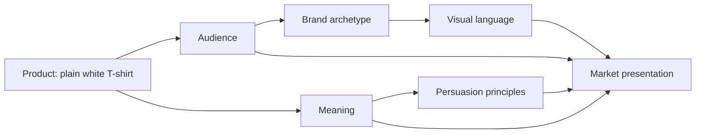

# The Plain White T-Shirt Case Study

A plain white T-shirt is the perfect test case for persuasion, archetype, and design language. It is a simple object. It is familiar. It is cheap to produce and easy to wear. Yet under the right framing, it can be sold as a tool for adventure, a sign of disciplined taste, a loud act of rebellion, or a luxury badge of identity.

The shirt does not change. The story around it does.

This chapter looks at four radically different market presentations for the same ordinary high-quality plain white T-shirt. The goal is not to decide which version is “best,” but to see how product, audience, meaning, persuasion, and visual language work together to create a market presentation.

## The Product: One Shirt, Many Meanings

Imagine a high-quality plain white T-shirt made from a soft, durable cotton blend. It fits well, holds its shape, and is comfortable enough to wear almost anywhere. It is modest in appearance and highly adaptable.

That is the physical product: one shirt, one basic silhouette, one neutral color.

The real work begins when a brand decides what the shirt means.

## Concept 1: The Explorer

### Audience
Young adults and urban travelers who want to feel mobile, capable, and lightly adventurous.

### Chosen brand archetype
Explorer

### Persuasion principles being used
- Functionality and utility
- Social proof through travel and outdoor communities
- Scarcity through limited seasonal drops
- Identity alignment with independence

### Visual-design language
Open, airy, practical, slightly rugged. Sparse layouts, high-contrast photography, natural color palette, generous white space, directional typography.

### Headline
“Built for the next mile.”

### Short product story
This is not a fashion object. It is a daily companion for movement. It travels light, dries quickly, and is comfortable enough to live in while you go from train platform to trailhead to café without changing your pants.

### Imagery direction
A shirt photographed in motion: walking through a city at sunrise, sitting on a train window seat, hanging over a backpack in a mountain scene, or folded neatly in a compact travel bag. The photography should feel unforced and alive.

### What meaning the customer is actually being invited to buy
The customer is buying a version of themselves as someone who is free, capable, and not pinned down by rigid routines or expensive gear. The shirt promises mobility, not status.

### Ethical concern or possible misuse
The risk is that the brand may present “adventure” as a lifestyle identity while ignoring the fact that many people do not have the time, money, or safety to move freely. The persuasion is believable because it taps into a desire for freedom, but it can become romanticized if it hides real constraints.

## Concept 2: The Minimalist Sage

### Audience
Professionals, university students, and people who want a clean, reliable wardrobe built around clarity and intention.

### Chosen brand archetype
Sage

### Persuasion principles being used
- Authority through restraint and competence
- Commitment and consistency through a “buy less, buy better” identity
- Cognitive ease through simple design
- Framing around quality and longevity

### Visual-design language
Modernist and Swiss-influenced. Narrow grid, disciplined typography, strong hierarchy, generous margins, restrained color palette, asymmetrical but controlled layout, low visual noise.

### Headline
“Essential. Considered. Uncomplicated.”

### Short product story
This shirt is a quiet object for thoughtful people. It is cut well, made to last, and designed in a way that does not ask for attention. It belongs to a life of clarity rather than excess.

### Imagery direction
Product shot with strong negative space. The shirt on a neutral background, maybe photographed with exact folds and careful framing. The typography is crisp, minimal, and highly structured. No clutter, no crowd, no slogan overload.

### What meaning the customer is actually being invited to buy
The customer is buying a sense of control, intelligence, and taste. The shirt becomes part of a moral and aesthetic attitude: choosing quality over noise, function over performance, and consistency over trend-chasing.

### Ethical concern or possible misuse
This version can easily slip into moral superiority. It may suggest that people who buy more colorful, playful, or trendy things are somehow less thoughtful. The persuasive appeal is strong because it sounds rational, but it can become an unhelpful judgment disguised as taste.

## Concept 3: The Rebel

### Audience
Creative students, independent workers, and people who want to signal anti-status, anti-conformity, and cultural self-awareness.

### Chosen brand archetype
Rebel

### Persuasion principles being used
- Social proof through subculture signaling
- Scarcity through small-batch drops
- Liking through attitude and authenticity
- Framing around anti-consumption

### Visual-design language
Disruptive, postmodern, intentionally rough. Collage textures, uneven spacing, exaggerated typography, references to youth culture, anti-grid composition, bold contrast, rough edges, visual tension.

### Headline
“Not a uniform. A refusal.”

### Short product story
This T-shirt rejects the polished language of the luxury market. It is not trying to be tasteful in a conventional way. It is a statement against polished branding, corporate sameness, and the pressure to look properly “normal.”

### Imagery direction
Messy compositions: torn paper textures, offset placements, black-and-white photography with high contrast, layered text snippets, oversized type that collides with the image. The shirt may appear slightly rumpled, intentionally not displayed as a perfect product shot.

### What meaning the customer is actually being invited to buy
The customer is buying self-definition. This is not just a shirt. It is a tool for refusing to look like the market expects. The shirt becomes a visible challenge to sameness.

### Ethical concern or possible misuse
The danger here is that rebellious branding can become a performance of rebellion without real substance. It can easily become “authenticity theater” if the product is just another well-managed way to sell attitude. There is also a risk of creating identity through exclusion: the message can say, “Those who don’t fit this style are less serious.”

## Concept 4: The Lover or Magician

### Audience
People drawn to beauty, emotional storytelling, ritual, and sensory richness—especially customers who want their wardrobe to feel personal and memorable.

### Chosen brand archetype
Lover or Magician

### Persuasion principles being used
- Liking through emotional appeal
- Narrative meaning
- Reciprocity through ritual and “gift-like” experience
- Authority softened by sensual craft and story

### Visual-design language
Atmospheric and luxurious, but not necessarily restrained. Warm color tones, layered textures, intimate photography, romantic copy, slow pacing, emotional emphasis over utility.

### Headline
“Wear the feeling you were hoping to find.”

### Short product story
This shirt is not just a basic staple. It is the garment you reach for when you want a ritual of self-renewal, a moment of softness, or a quiet declaration of personal style. It creates a mood, not just a silhouette.

### Imagery direction
Close-up details: fabric texture, collar lines, soft folds, skin-toned photographs, long shadows, intimate framing, warm light, and rich editorial composition. It should feel sensual without becoming vulgar or generic.

### What meaning the customer is actually being invited to buy
The customer is buying emotion, atmosphere, and feeling special. The shirt becomes a symbol of intimacy, beauty, and self-recognition. It is not just clothing; it is a mood object.

### Ethical concern or possible misuse
This concept can risk emotional manipulation. If the brand overstates the emotional promise, it may turn a simple garment into a false cure for loneliness, self-doubt, or lack of identity. The persuasion works because it appeals to desire, but it needs honesty to avoid becoming manipulative.

## Synthesis Table

| Concept | Audience | Archetype | Main persuasion principles | Visual language | Core meaning being sold | Ethical risk |
| --- | --- | --- | --- | --- | --- | --- |
| Explorer | Travelers, mobile young adults | Explorer | Utility, scarcity, identity, social proof | Open, airy, rugged, practical | Freedom, movement, independence | Romanticizing adventure while ignoring real constraints |
| Minimalist Sage | Students, professionals, quality-conscious buyers | Sage | Authority, cognitive ease, consistency, framing | Modernist / Swiss influenced | Clarity, discipline, thoughtful living | Moral superiority disguised as taste |
| Rebel | Creative, anti-status audience | Rebel | Social proof, scarcity, authenticity, anti-conformity | Disruptive, postmodern, collage-like | Defiance, originality, nonconformity | Authenticity as performance rather than substance |
| Lover / Magician | Emotionally driven shoppers, aesthetic consumers | Lover or Magician | Narrative, emotion, liking, ritual | Atmospheric, luxurious, intimate | Beauty, emotion, transformation | Emotional overpromise or false cure |

## Market Presentation Diagram

This diagram matters because it shows that a product is not sold by the shirt alone. A market presentation is a combination of who the product is for, what meaning it carries, how it tries to persuade, and how it looks. The shirt remains the same, but the entire presentation changes its value.

## Why This Matters in Design

The plain white T-shirt case study is useful because it strips away some of the complexity of branding. There are no complicated features, no technological novelty, no hidden engineering to explain. The shirt is almost intentionally plain. That makes the strategy visible.

This is exactly why it is valuable. A designer can see how meaning is being built, not hidden. The shirt becomes a container for a way of life, an identity, or an emotional promise.

When a brand is successful, it does not simply say, “We have a T-shirt.” It says, “This T-shirt lets you be a certain kind of person.”

## What You Should Remember

- The same physical product can support multiple meanings depending on audience, narrative, and design language.
- Brand archetypes are not personality labels; they are useful ways to describe the emotional role a brand plays in culture.
- Persuasion works best when it aligns with real human needs, not when it invents artificial desires.
- Modernist design can make a product feel clear, rational, and essential, while postmodern design can make it feel rebellious, ironic, or culturally expressive.
- A strong market presentation combines product, audience, meaning, persuasion, and visual language into one coherent story.
- Ethical design means avoiding pressure, deception, or manipulation while still creating a compelling and truthful message.

The white T-shirt is ordinary, but it is not empty. It is a blank page for identity, and that is exactly why it is such a useful case study.
