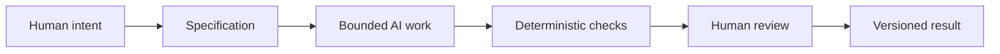

# Synthesis: Persuasion, Archetype, Design, and AI

The first four chapters of this guide each looked at a different part of the same problem: how meaning is created and communicated. Persuasion asks what response we want to enable. Archetype asks what identity or meaning we are expressing. Design language asks how that meaning should look, feel, and be arranged. Taken together, they form a useful framework for directing creative and technical work, including work done with AI.

This is not a theory of magic. It is a practical way to manage attention and intention. A good project begins with a real question: what are we trying to achieve, for whom, and why?

## One Framework for Creative and Technical Work

The three lenses fit together like this:

- Persuasion helps answer: what response are we trying to enable?
- Archetype helps answer: what meaning or identity are we expressing?
- Design language helps answer: how should that meaning look and feel?

A strong product or communication effort needs all three.

- If we only think about persuasion, we may create pressure without meaning.
- If we only think about archetype, we may produce a personality without a clear action.
- If we only think about visual language, we may create appealing surfaces without purpose.

The real work is to connect them: audience, meaning, and expression.

## A Simple Example: The White T-Shirt Again

The plain white T-shirt is useful here because it stays physically the same while being framed in wildly different ways. A single shirt can be positioned as:

- a practical item for movement and exploration
- a considered symbol of clarity and restraint
- a rebellious act against conformity
- an object of emotional richness or transformation

The product is constant. The intended response, expressed identity, and visual language are not.

This is the same principle that applies to AI-assisted work. The underlying material may be the same, but the prompt, the frame, and the structure determine what kind of output emerges.

## Why AI Needs Boundaries

AI is powerful because it can generate text, code, images, and structure quickly. That speed is useful, but it also creates risk. Without a clear specification, an AI system may produce output that is broad, vague, inconsistent, or disconnected from the real goal.

A specification gives the work boundaries. It defines:

- the purpose
- the audience
- the constraints
- the desired output format
- the decision criteria
- the evaluation method

This matters because AI does not automatically know whether the output is good, true, ethical, or appropriate. It can imitate patterns and produce convincing language without understanding the full context. A good specification keeps the work in a productive range.

In other words, a bounded task is much easier to evaluate than a vague request like “make this better” or “design something cool.” Precision reduces drift.

## The Need for Version Control and Traceability

When AI tools are used for writing, design, coding, or content generation, the work can change rapidly. One prompt may create an elegant draft, another may produce a weak version, and a third may produce something completely off-track. Without version control, it becomes difficult to know what changed, why it changed, and what should be recovered.

Git gives traceability. It records changes over time. It allows a project to be revisited, compared, and restored. This is important because AI output is often probabilistic: it can be plausible and still wrong.

Git also enables recovery. If a generated version goes badly off course, the team can return to a prior state. This makes experimentation safer and more disciplined.

A version-controlled workflow is not bureaucracy for its own sake. It is an accountability system.

## Deterministic Checks and Cheap Validation

Not every part of creative work can be validated by a simple machine output, but some can. Deterministic automated checks are useful because they are cheap, repeatable, and fast.

Examples might include:

- checking whether files are present in the right place
- verifying required headings or structure
- validating Markdown syntax
- checking that a document includes required sections
- running tests or validation scripts on code

These checks are valuable because they reduce the cost of mistakes. A human can review the same thing many times, but automation is often better suited to checking pattern, structure, and consistency.

This is especially true in a workflow that combines AI output and formal artifacts. The question is not whether AI should replace judgment, but whether cheap automated validation can catch obvious failures before human review begins.

## AI Review: Helpful, but Probabilistic

AI can be useful in review workflows. It can look for missing sections, summarize differences, flag contradictions, or suggest areas that need a closer human read. That kind of assistance can be valuable. But it is probabilistic, not certain.

AI review is not the same as truth. It may sound confident while missing important context. It may prefer smooth, coherent wording over a difficult but necessary corrective. It may overlook ethical or conceptual problems because those problems are not always visible from the text alone.

This is why AI review should be treated as a support tool, not a final authority.

## The Pit-Stop Metaphor

A race-car pit stop is a good metaphor for human review. The car can keep running through a series of automated checks and adjustments, but selected moments require deliberate human intervention.

In a pit stop, the team does not stop the entire system for every single detail. They focus on the moments that matter: tire pressure, fuel, alignment, safety, timing, and strategy. Likewise, in AI-assisted work, humans should not micromanage every step. They should instead inspect the points where judgment matters most.

This is the right place for human review:

- when meaning is ambiguous
- when the work affects real people
- when truthfulness matters
- when ethical trade-offs are involved
- when the output must fit a specific context or institutional constraint

Automation can keep the process moving. Human review happens at the critical moments.

## Human Responsibility Remains Central

The final responsibility remains with humans. Humans are accountable for:

- intent
- meaning
- truthfulness
- audience context
- ethical judgment
- interpretation of constraints
- final decisions

AI can accelerate work, but it does not replace the need for judgment. A designer or writer still has to decide what matters, what is true, what is appropriate, and what kind of response the work is trying to enable.

A machine can produce a plausible answer. Only a human can decide whether it should be published, sent, used, or revised.

## The Full Workflow

This workflow is a control system rather than a mystical path to brilliance. It keeps creative work honest, guided, and recoverable. The specification defines what success looks like. AI does the heavy lifting inside those boundaries. Deterministic checks catch obvious failures. Human review handles the meaningful decisions. The versioned result preserves the project history.

## Connecting the Three Lenses to AI Work

When used well, the framework behaves like a design brief for modelling work:

- Persuasion clarifies the desired response: should the audience trust, act, remember, compare, or feel something specific?
- Archetype clarifies meaning: what identity or relationship is being expressed?
- Design language clarifies form: what should this look like, sound like, and feel like?

Then the AI task is shaped by a specification that makes those choices concrete. The model is not asked to “be creative” in the abstract. It is asked to generate work within a bounded, intentional frame.

That is why good AI-assisted work often resembles good design work: not random creativity, but guided direction.

## Questions for Next Week

- What kinds of tasks are best bounded by a specification?
- Where do deterministic checks fail to catch important problems?
- When is AI review helpful, and when is it risky?
- How do you decide which moments deserve direct human inspection?
- How can persuasion, archetype, and visual language help guide a project before any AI tool is used?
- What kinds of project constraints make AI output more trustworthy?

## What You Should Remember

- Persuasion, archetype, and design language work together as a practical framework for meaning and communication.
- An AI task should be bounded by a specification so the work stays focused and evaluable.
- Git provides traceability, recovery, and a clear history of what changed.
- Deterministic checks are useful for cheap, repeatable validation before human review.
- AI review can help, but it is probabilistic and should not replace judgment.
- Human beings remain responsible for meaning, truthfulness, context, ethics, and final decisions.
- The best workflows combine automation with selected human attention, just as a pit stop combines speed with deliberate inspection.

The goal is not to remove human judgment from creative work. The goal is to make that judgment more informed, more structured, and more responsible.
